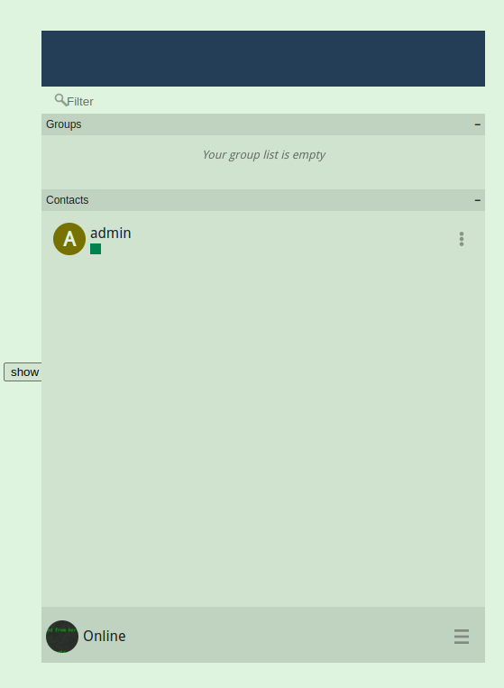

# jsxc-react-hook
  [Jsxc](https://github.com/jsxc/jsxc) is a js/ts xmpp client, it support vedio/voice call. This is a react function version for JSXC. So you can use it in react application.
## demo
  when click 'show' button, it will show a jsxc instance

  
## usage
 - import {Jsxc} from 'jsxc-react-hook'
 - then copy public/jsxc.bundle.js(it changes according origin jsxc code) to you public folder which include entry html file, as demo example.

## props
  ```

      boshUrl: string;
      id: string; (jid)
      pw: string; (password)
      marginTop?: string; (defalut is 40px)
      marginLeft?: string; (defalut is 40px)
      marginBottom?: string; (defalut is 40px)
      marginRight?: string; (defalut is 40px)
      fullscreen?: boolean; (defalut is false)
      jqueryUrl?: string;

  ```

## script
- npm run dev: it will run a demo.
- npm run build: it will build a lib according src source files.
- !!!: you need install react-activation package. And add <Keepalvie> to arround the Jsxc component, so that it can work normally.:)
